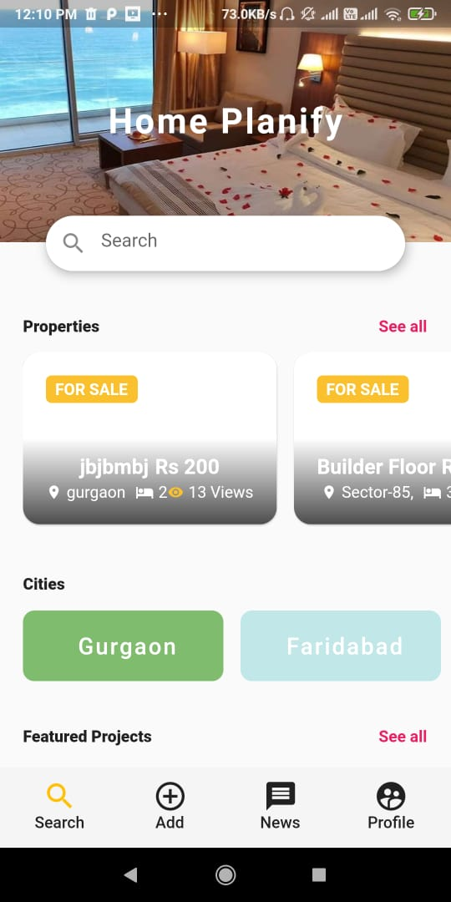
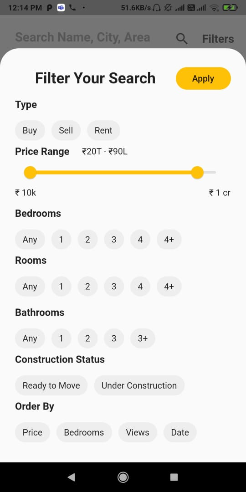
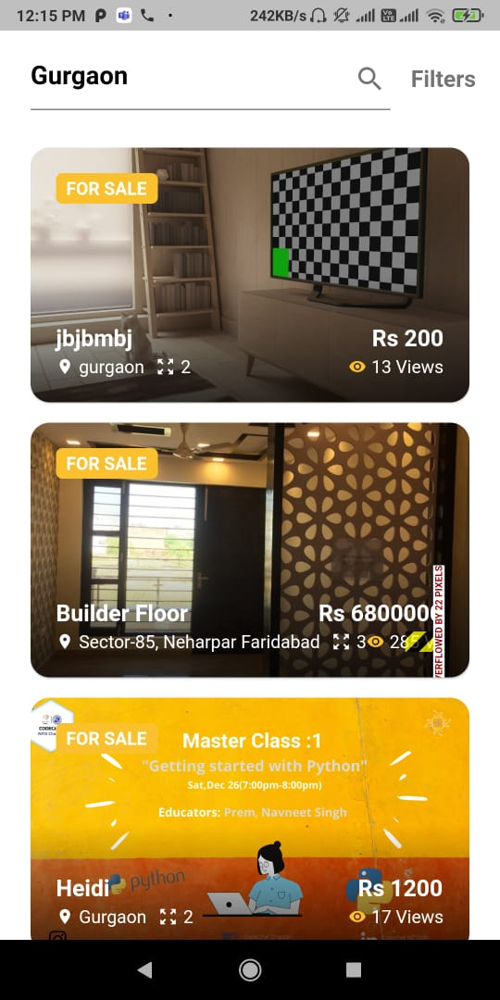

# [Housing](https://www.homeplanify.com/)
[](https://forthebadge.com) [](https://forthebadge.com) [](https://forthebadge.com) [](https://forthebadge.com)


## Table of Contents

* [About the Project](#about-the-project)
  * [Built With](#built-with)
* [Getting Started](#getting-started)
  * [Prerequisites](#prerequisites)
  * [Installation](#installation)
  * [Usage](#usage)
* [Frontend](#frontend)
    * [Flutter](#flutter)
* [Backend](#backend)
    * [Django](#django)
* [Screenshots](#screenshots)
* [Authors](#authors)
* [Contributing](#contributing)
* [License](#license)

## About the Project 🚀
[Housing](https://www.homeplanify.com/) is a fully-functional Housing Property Plarform, integrated with :

1. Django, for Back-End prgramming
3. Dart/Flutter, for cross-platform native mobile application. 

At HomePlanify, we believe that when it comes to finding a home what's outside the front door is just as important as what's behind it. A Home is one of the most expensive things in one's life and we make certain you get the best deals with us

### Built With
*   Dart
*   Flutter SDK
*   Django

[Back to Table of Contents](#table-of-contents)

## Getting Started

### Prerequisites
* Android Studio (or Visual Studio Code)
* Flutter SDK
* Dart
* Django


### Installation


* Backend

  * Django
  
    ```
    $ python -m pip install Django
    ```
    
* Frontend

  * Android Studio
    
    Download [Android Studio](https://developer.android.com/studio)
    
    ```
    $ cd android-studio/bin
    $ ./studio.sh
    ```
    
  * Flutter SDK
    1. tart Android Studio.
    2. Open plugin preferences (Configure > Plugins as of v3.6.3.0 or later).
    3. Select the Flutter plugin and click Install.
    4. Click Yes when prompted to install the Dart plugin.
    5. Click Restart when prompted.
  

### Usage

* To Run Application
    
    ``` 
    $ git clone https://github.com/mahajanayush77/housing.git
    $ cd housing/
    $ flutter run
    ```
    
[Back to Table of Contents](#table-of-contents)

## Frontend

* #### Flutter
    Flutter is Google’s UI toolkit for building beautiful, natively compiled applications for mobile, web, and desktop from a single codebase.
    
    * ###### Why Flutter ?
        *  Fast development - Hot reload and Hot restart
        *  Expressive, beautiful UIs
        *  Native Performance
        *  Incredibly versatile
        *  Active Developer Community
        
    

## Backend

* #### Django
    Django is a high-level Python Web framework that encourages rapid development and clean, pragmatic design. Built by experienced developers, it takes care of       much of the hassle of Web development, so you can focus on writing your app without needing to reinvent the wheel. It's free and open source.

    * ##### Why Django ?
       * Ridiculously fast
       * Reassuringly secure
       * Exceedingly scalable
       * Incredibly versatile
       * Easy to Integrate with Python Libraries/Functions

## Features

* #### Login and Registration
    *  Registration and login for User
    *  User can view his/her profile

* #### Blog Section
    *  User can view blog section, only after registration, or login
    *  User can create new blogs.
    *  User can like and comment on blogs. 

* #### Profile
  
    *  User can view his/her profile
    *  User can edit his/her details
    *  User can view their properties
    *  User can see thier bookmarked properties
    *  User can change his/her password

* #### Properties

    * User can search for a property.
    * User can see suggestion of properties in ther homepage
    * User can filter properties, with various condition, such as by cities, by size, by BHK, etc.
    * User can see features projects
    
* #### Adding New Properties
     
     * User can add new properties.
     * User can specify various attributes such as decription, rooms, bathrooms, featured images, property images, youtube link, etc.
     * Proper Form Validation, for easy UX.


[Back to Table of Contents](#table-of-contents)

## Screenshots

         
      


### A few resources to get you started if this is your first Flutter project:

- [Lab: Write your first Flutter app](https://flutter.dev/docs/get-started/codelab)
- [Cookbook: Useful Flutter samples](https://flutter.dev/docs/cookbook)

For help getting started with Flutter, view our
[online documentation](https://flutter.dev/docs), which offers tutorials,
samples, guidance on mobile development, and a full API reference.
